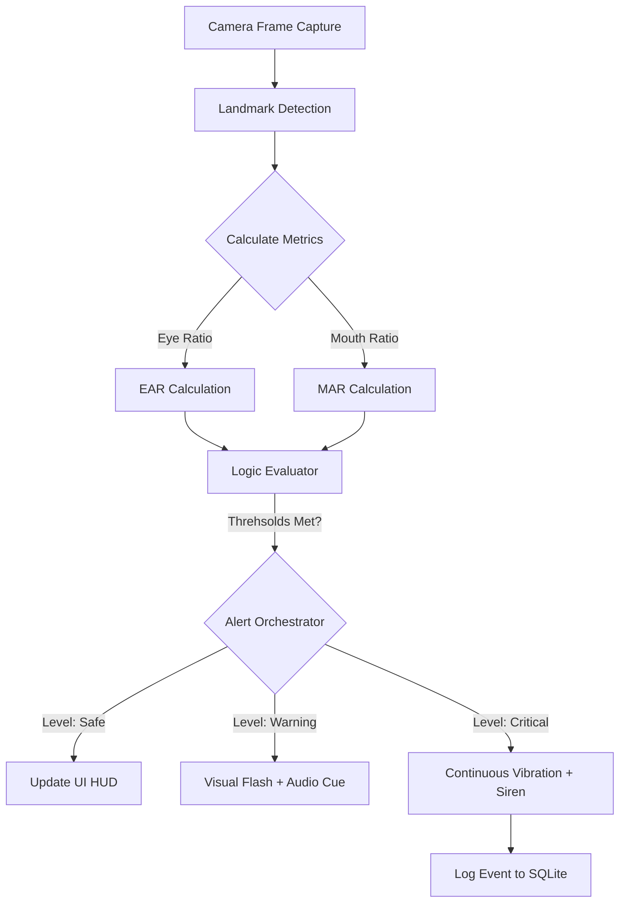

# Vigilance AI — System Design & Architecture

This document details the underlying system architecture, data flow, and design patterns of the Vigilance AI driver safety system.

## 1. High-Level Architecture
Vigilance AI is built on a **Decentralized Edge-AI Architecture**. Unlike traditional systems that rely on cloud-based processing, all inference, monitoring, and alerting occur locally on the mobile device. This ensures zero latency and maximum privacy.

### Core Modules:
- **Vision Engine (Inference Tier):** Interfaces with the device camera to capture frame data and calculate metrics (EAR, MAR).
- **Logic Engine (Processing Tier):** Evaluates raw metrics against safety thresholds to determine the Alert Level.
- **Feedback Engine (Output Tier):** Orchestrates multi-sensory alerts (Audio, Haptics, Visual UI updates).
- **Persistence Tier:** Manages local session logging and user configuration.

---

## 2. Component Design & Patterns
The system follows a clean, modular pattern designed for scalability and performance.

### A. Observer Pattern (Global State)
The `MonitoringState.ts` serves as a centralized observer. 
- **Responsibility:** Broadcasts real-time alert level changes across the app.
- **Benefit:** Allows decoupled UI components (like the tab bar or dashboard) to react to drowsiness detection without direct dependencies on the camera engine.

### B. Custom Hooks (Logic Encapsulation)
- **`useAlertManager.ts`:** Encapsulates the core safety logic. It manages the transition between `Safe`, `Warning`, and `Critical` states. It also handles the throttling of sound and vibration triggers to avoid "alert fatigue."

### C. Resource Lifecycle Management
- **Wake Lock:** The system utilizes `expo-keep-awake` to ensure the screen and AI processor remain active throughout the entire drive.
- **Audio Scoping:** Uses `expo-av` with a dedicated reference handler to ensure that alert sounds stop and unload correctly when the app is backgrounded or the session ends.

---

## 3. Data Flow (The Monitoring Loop)
The monitoring loop operates at a frequency of ~6.6Hz (every 150ms) to maintain a balance between detection accuracy and thermal performance.

---

## 4. Safety Thresholds & Biometrics
The system is calibrated based on industry-standard biometric ratios:

| Metric | Threshold Type | Value | Trigger |
| :--- | :--- | :--- | :--- |
| **EAR** | Lower Bound | < 0.25 | Warning (Drowsiness Symptoms) |
| **EAR** | Critical Bound | < 0.20 | Critical (Eyes Closed) |
| **MAR** | Upper Bound | > 0.50 | Warning (Consistent Yawning) |
| **Blink** | Pulse | ~200ms | Increments Session Blink Counter |

---

## 5. Security & Privacy Model
1. **On-Device Only:** No video frames or biometric data are transmitted off the device.
2. **Ephemeral Inference:** Frames are processed in RAM and immediately discarded; only summary event statistics (e.g., "Critical Alert at 10:15 PM") are persisted.
3. **Encapsulated Storage:** `SafeStorage.ts` provides a hardened wrapper around standard storage to prevent data corruption during unexpected app shutdowns.

---

## 6. Optimization Strategies
- **Native Driver Animations:** Visual HUD pulses and flashes are offloaded to the Native UI thread to ensure consistent frame rates even under heavy CPU load.
- **Conditional Rendering:** The camera viewfinder is only active in `Monitor` or `Drive` modes to conserve battery.
- **Throttled Logging:** Only significant alerts are written to the database to minimize disk I/O and maximize battery life.
