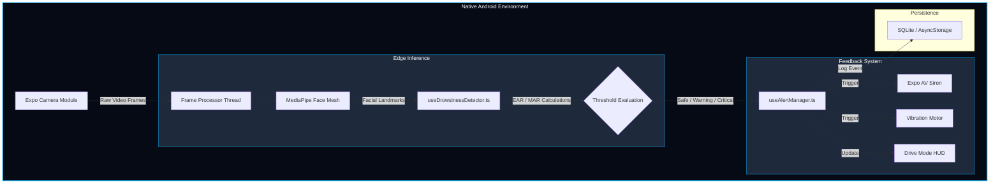
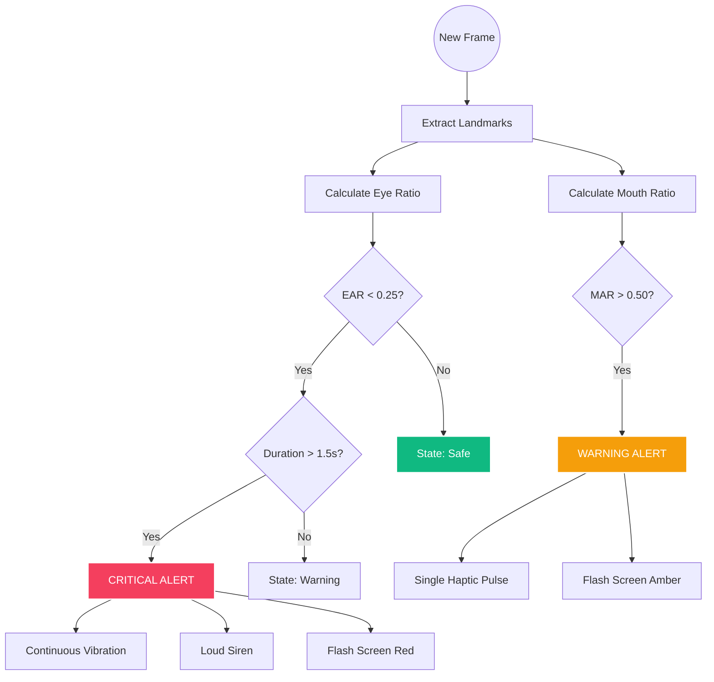

# Vigilance AI — Project Status Report
**Project Name:** VigilanceAI
**Status:** Alpha / Internal Testing Phase
**Target Platform:** Android (Native Edge-AI)

## 1. Executive Summary
VigilanceAI is a state-of-the-art Drowsiness Detection system designed to enhance driver safety. Utilizing On-Device Computer Vision (Edge AI), it monitors the driver's state in real-time to detect signs of fatigue and distraction. The application provides immediate auditory and haptic feedback to alert the driver, thereby preventing accidents.

## 2. System Architecture (Visualized)
The system operates on a decentralized Edge-AI model, processing all video feeds locally on the Android device to ensure zero latency and complete privacy.

## 3. Logic & Decision Flow
The application evaluates driver state every ~150ms using the following decision tree:

## 4. Core Features & Tech Stack

### Feature Set
| Category | Capability |
| :--- | :--- |
| **Monitoring** | Real-time Eye Aspect Ratio (EAR) & Mouth Aspect Ratio (MAR) tracking. |
| **Alerts** | Dynamic 3-stage system (Safe, Warning, Critical) with distinct audio/haptic patterns. |
| **Analytics** | Weekly drowsiness trends, alert distribution charts, and risk heatmaps. |
| **Interface** | specialized "Drive Mode" with high-contrast, distraction-free UI. |

### Technical Stack
| Component | Technology |
| :--- | :--- |
| **Framework** | React Native 0.76 + Expo SDK 55 |
| **Language** | TypeScript (Strict Mode) |
| **Vision** | Expo Camera + MediaPipe Face Mesh |
| **Animation** | React Native Reanimated v4 (UI Thread) |
| **Storage** | `@react-native-async-storage` & SQLite |

## 5. UI/UX Design System
The app follows a premium **Cyber-Tech Aesthetic**:
- **Primary Background:** Deep Obsidian (`#050A14`)
- **Accent Color:** Electric Blue (`#0EA5E9`)
- **Status Colors:** 
  - 🟢 **Safe:** Emerald (`#10B981`)
  - 🟡 **Warning:** Amber (`#F59E0B`)
  - 🔴 **Critical:** Rose (`#F43F5E`)
- **Typography:** Modern Sans-Serif (Inter/Roboto) for maximum legibility.

## 6. Recent Engineering Updates
During the recent debugging and testing phase, several critical enhancements were made:
1. **Native Module Fallbacks:** Implemented robust error handling for AV and Storage modules.
2. **Memory Optimization:** Refined the monitoring loop to prevent leaks during long drives.
3. **Navigation Stability:** Finalized Expo Router layout structure.
4. **Cross-Platform Parity:** Unified styling for Android shadow rendering.

## 7. Next Steps & Roadmap
- [ ] **Model Calibration:** Auto-adjust thresholds based on driver's baseline.
- [ ] **Production Vision:** Bind live camera frames to MediaPipe FaceLandmarker.
- [ ] **Cloud Sync:** Encrypted summary upload for fleet analytics.
- [ ] **Gaze Tracking:** Add head pose estimation for distraction detection.

---
*Report generated on March 13, 2026*
